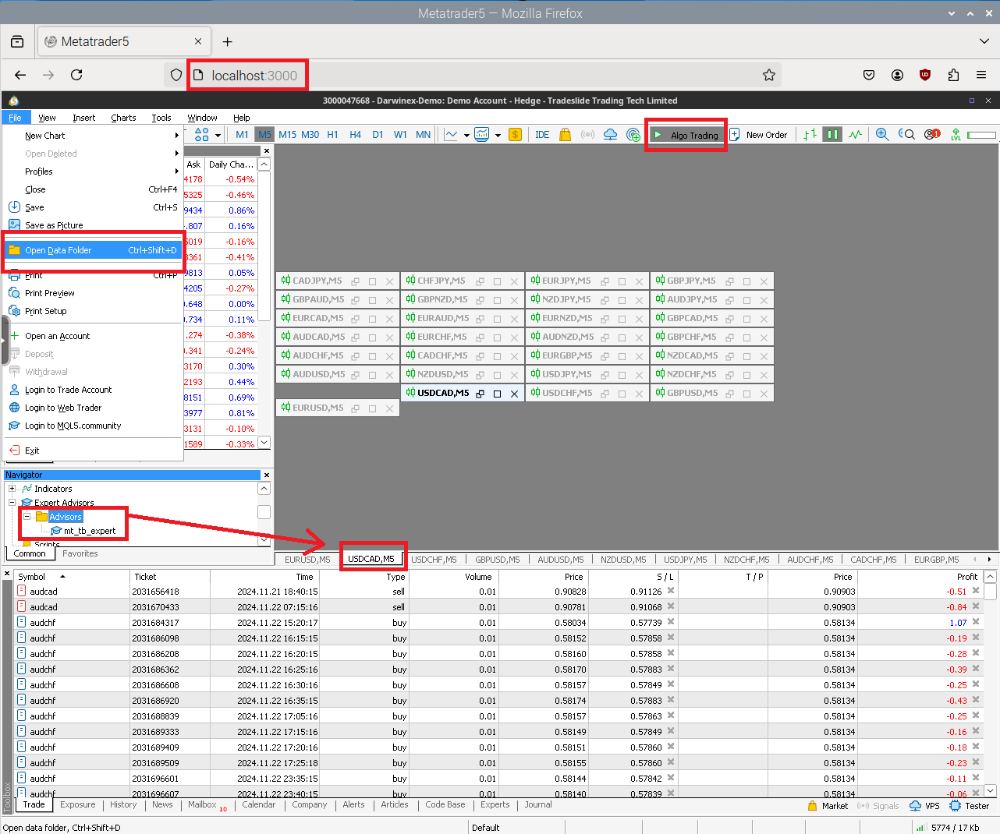

# Forex bot in Metatrader 5 (Docker) 🤖📈

## What is this project about
This project uses the ⭐🚀 [tradeo](https://github.com/sorul/tradeo) 🚀⭐ 
library to build a forex bot using MetaTrader 5.

I used Docker to create an image that contains Wine 🍷 and MetaTrader 5. 
I create a bind between the Docker container and the project to have access 
to the files generated by the bot.

## MetaTrader config
Only first time is required to install tonistiigi/binfmt image before run the docker-compose:
```bash
docker run --privileged --rm tonistiigi/binfmt --install all
```

Run "make run_docker" to activate MetaTrader.
If a connection error occurs on Debian repository packages, 
run the "make run_docker" command again. If a permission error occurs,
use "sudo chmod -R 777" to metatrader folder.

Once it's available, access it through the browser at [localhost:3000](http://localhost:3000).

1) Log in to your broker account.
2) Add the symbols you want to trade. 
There is the option for the bot to open them automatically, but I do not recommend it.
3) Locate the data folder. To do so, you need to go to File > Open Data Folder.
Copy the last folder name, for example: D0E8209F77C8CF37AD8BF550E51FF075
4) Download [mt_tb_expert.ex5](https://github.com/sorul/tradeo/raw/refs/heads/master/docs/files/mt_tb_expert.ex5)
file and put it in the proper directory: ./metatrader/.wine/drive_c/users/abc/AppData/Roaming/MetaQuotes/Terminal/D0E8209F77C8CF37AD8BF550E51FF075/MQL5/Experts/Advisors/mt_tb_expert.ex5
5) Activate the "Algo Trading" button at the top of MetaTrader.
6) Double click in the expert to activate it in any symbol chart (e.g. USCAD, M5), it does not matter which chart you use. But only in one of them.



## Environment variables
We copy the ".env" file suggested by the 
[README](https://github.com/sorul/tradeo?tab=readme-ov-file#execution-of-your-project-if-you-import-this-library) 
of the Tadeo library.

## How I execute the project

I edit de crontab (crontab -e):

```console
@reboot cd ~/git/sorul_tradingbot/ && make start_docker
*/5 * * * 0-5 cd ~/git/sorul_tradingbot/ && make run_forex
```
